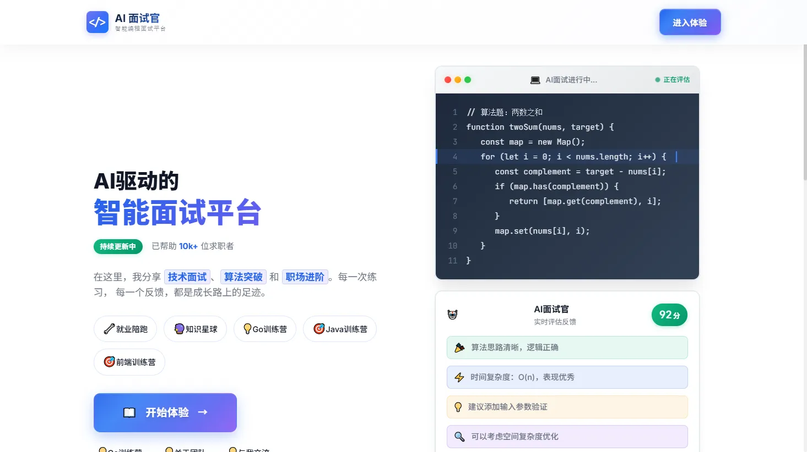
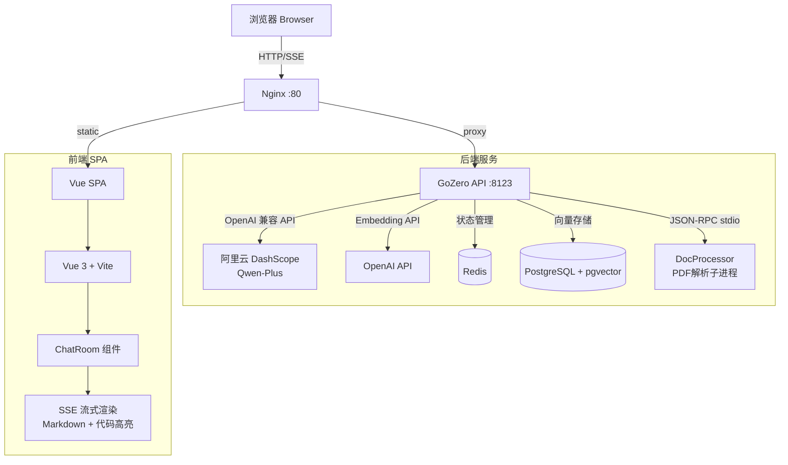

# AI 面试官 (AI Interview Assistant)

<p align="center">
  <strong>让每次面试都成为成长机会</strong>
</p>

<p align="center">
  
</p>

---

## 📖 项目简介

**AI 面试官** 是一个面向程序员的 AI 驱动模拟面试平台。它能够扮演真实技术面试官的角色，围绕算法、系统设计、编程技能进行深度提问、追问与评估。平台支持上传 PDF 简历让 AI 定制个性化问题，也支持构建知识库通过语义检索辅助问答，真正帮你把每一次面试变成可复盘的训练。

---

## ✨ 核心功能

### 模拟面试
完整的 AI 面试流程，通过状态机管理面试的五个阶段：

```
start → question → follow_up → evaluate → end
```

- **开场破冰** — AI 根据上传的简历发起自然对话
- **技术问答** — 覆盖算法、系统设计、语言基础等方向
- **深度追问** — 根据你的回答进行针对性追问
- **综合评估** — 给出多维度面试评分与改进建议
- **会话持久化** — 基于 `chatId` 的会话隔离，支持历史记录

### 简历解析
- 上传 PDF 格式简历，系统自动解析文本内容
- AI 根据候选人真实项目经验定制面试方向
- 支持前端 PDF 预览 (pdf.js)

### 知识库 (RAG)
- 上传 PDF 知识文档，自动文本提取 → 分块 → 向量化
- 存入 PostgreSQL + pgvector，面试中语义检索相关知识上下文
- 注入到 System Prompt 辅助 AI 回答更专业

### 深度思考模式
- 对话输入区可切换 **"深度思考"** 模式
- 切换后 AI Prompt 策略变化，回答更加深入详尽

### 流式对话渲染
- SSE (Server-Sent Events) 实时流式推送
- 完整的 Markdown 渲染 (marked) + 代码高亮 (highlight.js)
- 支持 LaTeX 数学公式渲染 (KaTeX)
- 气泡式对话 UI + 玻璃拟态设计

### 双模式 AI
| 模式 | 路径 | 说明 |
|------|------|------|
| AI 面试官 | `/interview-master` | 结构化面试，支持简历上传、状态机管理 |
| AI 超级智能体 | `/interview` | 通用 AI 对话，深度思考模式 |

---

## 🛠 技术栈

### 前端
| 技术 | 版本 | 用途 |
|------|------|------|
| Vue 3 | ^3.2.47 | 框架 (Composition API) |
| Vite | ^4.3.9 | 构建工具 & 开发服务器 |
| Vue Router | ^4.1.6 | 路由 (hash mode) |
| Element Plus | ^2.10.4 | UI 组件库 |
| vue-element-plus-x | ^1.3.0 | XMarkdown / Sender 组件 |
| Axios | ^1.3.6 | HTTP 客户端 |
| marked | ^16.0.0 | Markdown 渲染 |
| highlight.js | ^11.11.1 | 代码语法高亮 |
| KaTeX | ^0.16.22 | LaTeX 公式渲染 |
| DOMPurify | ^3.2.6 | XSS 输入净化 |
| pdfjs-dist | ^5.3.31 | 前端 PDF 解析 |
| mammoth | ^1.9.1 | DOCX 解析 |
| Nginx (alpine) | latest | 生产环境静态文件服务 + 反向代理 |

### 后端
| 技术 | 用途 |
|------|------|
| Go 1.24.1 | 编程语言 |
| GoZero (go-zero) | 微服务框架 |
| PostgreSQL + pgvector | 向量数据库 (对话记录 + 知识库) |
| Redis | 面试状态机 & 会话缓存 |
| 阿里云 DashScope | LLM 大模型 (Qwen-Plus, OpenAI 兼容 API) |
| OpenAI API | 文本向量化 (text-embedding-v1) |
| ledongthuc/pdf | PDF 文本提取 (纯 Go, 无授权风险) |
| go-openai | OpenAI API Go SDK |
| pgx/v5 | PostgreSQL Go 驱动 |
| go-redis/v9 | Redis Go 客户端 |

### 基础设施
| 组件 | 说明 |
|------|------|
| Docker + docker-compose | 容器编排部署 |
| Nginx | 反向代理 + SSE 支持 + 静态资源 |
| JSON-RPC (stdio) | PDF 解析子进程通信协议 |

---

## 🏗 系统架构



### 数据流

```
用户消息 → Vue ChatRoom → fetch POST (multipart/form-data)
    → Nginx 反代 → GoZero ChatHandler
    → ChatLogic:
        1. Redis 读取面试状态
        2. PostgreSQL 检索知识库 & 历史记录
        3. 构建 System Prompt + 上下文
        4. 调用 DashScope 流式生成
    → SSE 逐 Token 推回 → ChatRoom 流式渲染
    → 对话内容 Embedding → 存入 PostgreSQL
    → Redis 更新面试状态
```

---

## 📁 项目结构

```
AI-interview/
├── README.md                          # 项目说明 (你在这里)
├── .gitignore
├── skills-lock.json                   # AI 设计 Skill 锁定版本
├── .agents/skills/                    # AI Agent 设计技能包
│   ├── frontend-design/               #   前端设计美学
│   ├── ui-ux-pro-max/                 #   UI/UX 设计系统
│   └── create-adaptable-composable/   #   Vue 可组合式 API 设计
│
├── vue-frontend/                      # Vue 3 前端工程
│   ├── index.html                     #   SPA 入口 (SEO 配置)
│   ├── package.json                   #   依赖管理
│   ├── vite.config.js                 #   Vite 配置 (代理/别名)
│   ├── nginx.conf                     #   生产环境 Nginx 配置
│   ├── Dockerfile                     #   前端镜像构建
│   └── src/
│       ├── main.js                    #   应用入口
│       ├── App.vue                    #   根组件
│       ├── style.css                  #   全局样式 & CSS 变量
│       ├── router/index.js            #   路由配置
│       ├── api/index.js               #   API 层 (SSE / Axios 封装)
│       ├── components/
│       │   ├── ChatRoom.vue           #   核心聊天组件
│       │   ├── AppFooter.vue          #   全局页脚
│       │   └── AiAvatarFallback.vue   #   AI 头像组件
│       └── views/
│           ├── Home.vue               #   首页 (产品展示)
│           ├── InterviewMaster.vue    #   AI 面试官页面
│           └── Interview.vue          #   AI 超级智能体页面
│
└── go-backend/                        # Go 后端工程
    ├── go.mod / go.sum                #   Go 依赖管理
    ├── docker-compose.yml             #   一键部署编排
    ├── README.md                      #   后端详细文档
    ├── todo.md                        #   优化清单 (P0-P3)
    ├── init-db/
    │   └── init.sql                   #   数据库 DDL (表 & 索引)
    ├── api/                           #   GoZero API 服务
    │   ├── Dockerfile                 #     多阶段构建镜像
    │   ├── entrypoint.sh              #     环境变量注入脚本
    │   ├── chat.go                    #     服务入口
    │   ├── chat.api                   #     goctl API 定义
    │   ├── etc/
    │   │   ├── chat.yaml              #       本地开发配置
    │   │   └── chat-docker.yaml       #       Docker 模板配置
    │   └── internal/
    │       ├── config/config.go       #     配置结构体
    │       ├── handler/               #     HTTP 处理器
    │       │   ├── routes.go          #       路由注册
    │       │   ├── chathandler.go     #       聊天 SSE 处理器
    │       │   └── knowledge_upload.go#       知识库上传处理器
    │       ├── logic/                 #     业务逻辑
    │       │   ├── chatlogic.go       #       聊天逻辑 (RAG + 流式)
    │       │   ├── knowledge_upload.go#       知识库上传逻辑
    │       │   └── state_manager.go   #       Redis 状态机
    │       ├── svc/                   #     服务依赖
    │       │   ├── servicecontext.go  #       DI 容器
    │       │   ├── vector_store.go    #       向量存储 CRUD
    │       │   └── pdf_client.go      #       PDF 子进程客户端
    │       ├── types/                 #     数据类型
    │       │   ├── types.go           #       通用类型 & 状态常量
    │       │   ├── knowledge_upload.go#       知识库类型
    │       │   └── session.go         #       会话/向量类型
    │       └── utils/unipdf.go        #     文本处理工具
    └── doc-processor/                 #   PDF 解析子进程
        ├── main.go                    #     JSON-RPC 服务入口
        └── internal/
            ├── mcp/handler.go         #     JSON-RPC 方法处理
            └── utils/pdf_utils.go     #     PDF 文本提取
```

---

## 🚀 快速开始

### 前置要求

- **Docker** & **Docker Compose** (后端一键部署)
- **Node.js** >= 16 (前端开发)
- **OpenAI API Key** (用于 Embedding)
- **阿里云 DashScope API Key** (用于对话生成)

### 1. 克隆项目

```bash
git clone <your-repo-url>
cd AI-interview
```

### 2. 配置环境变量

在 `go-backend/` 目录下创建 `.env` 文件：

```bash
# ── LLM 配置 (阿里云 DashScope) ──
OPENAI_API_KEY=sk-xxxxxxxxxxxxxxxxxxxxxxxx       # DashScope API Key
OPENAI_BASE_URL=https://dashscope.aliyuncs.com/compatible-mode/v1
OPENAI_MODEL=qwen-plus
OPENAI_MAX_TOKENS=2048
OPENAI_TEMPERATURE=0.7

# ── PostgreSQL 配置 ──
POSTGRES_USER=postgres
POSTGRES_PASSWORD=your_secure_password
POSTGRES_DB=interview_db

VECTOR_DB_HOST=postgres
VECTOR_DB_PORT=5432
VECTOR_DB_NAME=interview_db
VECTOR_DB_USER=postgres
VECTOR_DB_PASSWORD=your_secure_password
VECTOR_DB_TABLE=vector_store
VECTOR_DB_MAX_CONN=20
VECTOR_DB_EMBEDDING_MODEL=text-embedding-v1
VECTOR_DB_KNOWLEDGE_MAX_CHUNK_SIZE=1000
VECTOR_DB_KNOWLEDGE_TOP_K=5
VECTOR_DB_KNOWLEDGE_MAX_CONTEXT_LENGTH=4000

# ── Redis 配置 ──
REDIS_HOST=redis
REDIS_PORT=6379
REDIS_PASSWORD=
REDIS_DB=0

# ── MCP / DocProcessor 配置 ──
MCP_ENDPOINT=stdio://doc-processor
```

### 3. 一键部署后端 (Docker)

```bash
cd go-backend
docker-compose up -d
```

该命令会启动 4 个服务：
| 服务 | 端口 | 说明 |
|------|------|------|
| `redis` | (内部) | 会话状态缓存 |
| `postgres` | (内部) | 向量数据库 |
| `api` | 8123 | GoZero API 服务 |
| `frontend` | 80 | Nginx + Vue SPA |

数据库表结构会在容器首次启动时自动创建 (`init-db/init.sql`)。

### 4. 前端开发模式

```bash
cd vue-frontend
npm install
npm run dev
```

Vite 开发服务器在 `http://localhost:3000` 启动，API 请求自动代理到后端。

### 5. 停止服务

```bash
docker-compose down           # 停止但不删除数据
docker-compose down -v        # 停止并删除数据库数据
```

---

## 📡 API 接口

### 聊天对话 (SSE 流式)

```
POST /api/ai/interview_app/chat/sse
Content-Type: multipart/form-data
```

**请求参数：**

| 参数 | 类型 | 必填 | 说明 |
|------|------|------|------|
| `message` | string | 是 | 用户输入的面试回答 |
| `chatId` | string | 是 | 会话 ID (UUID) |
| `resume` | file | 否 | 上传 PDF 简历文件 |

**响应格式：** SSE (`text/event-stream`)

```
data: {"content": "你好，"}       # 逐 Token 推送
data: {"content": "欢迎"}
data: {"content": "参加"}
data: [DONE]                      # 流结束标记
```

### 知识库上传

```
POST /api/ai/knowledge/upload
Content-Type: multipart/form-data
```

**请求参数：**

| 参数 | 类型 | 必填 | 说明 |
|------|------|------|------|
| `file` | file | 是 | 上传 PDF 知识文档 |
| `title` | string | 是 | 文档标题 |

**响应示例：**

```json
{
  "code": 0,
  "message": "success",
  "data": {
    "chunks": 12,
    "title": "Go 语言高性能编程"
  }
}
```

---

## 🧩 技术亮点

### 1. 面试状态机 (Redis)
面试不走自由对话，而是严格的状态流转。每个 `chatId` 在 Redis 中维护状态 (`start` → `question` → `follow_up` → `evaluate` → `end`)，24 小时 TTL。AI 回答末尾的关键词触发状态跳转，不同状态注入不同的 System Prompt 指令。

### 2. RAG 检索增强生成
- 知识文档上传 → PDF 文本提取 → 文本分块 → Embedding 生成 → 存入 PostgreSQL
- 每次用户对话 → 消息 Embedding → JSONB 相似度检索 → Top-K 相关上下文注入 Prompt
- 聊天历史同样向量化存储，支持语义历史检索

### 3. 自定义 SSE (支持 POST + FormData)
浏览器原生 `EventSource` 仅支持 GET 请求，无法携带 FormData。前端基于 `fetch` + `ReadableStream` 实现自定义 SSE 客户端，支持 POST 方式发送 multipart/form-data，实现文件上传与流式响应的统一。

### 4. JSON-RPC 子进程 PDF 解析
PDF 解析器作为独立 Go 二进制 (`doc-processor`)，API 服务通过 `os/exec` 起子进程，使用 JSON-RPC 2.0 协议通过 stdin/stdout 通信。相比 HTTP 微服务，省去了网络开销和端口管理，适合低并发文件处理场景。

### 5. Markdown 安全渲染管道
```
AI 输出 → XSS 净化 (DOMPurify) → Markdown 解析 (marked)
    → 代码高亮 (highlight.js) → LaTeX 渲染 (KaTeX) → DOM 挂载
```

### 6. 玻璃拟态 UI 设计
首页和聊天界面采用玻璃拟态 (Glassmorphism) 设计风格，包括模糊背景、渐变色彩、浮动光晕、流畅动画，提供现代优雅的视觉体验。


---

## 📄 License

本项目仅供学习和研究使用。

---

## 🔗 相关链接

- [DashScope API 文档](https://help.aliyun.com/zh/dashscope/developer-reference)
- [OpenAI Embedding 文档](https://platform.openai.com/docs/guides/embeddings)
- [GoZero 官方文档](https://go-zero.dev/)
- [pgvector 文档](https://github.com/pgvector/pgvector)
