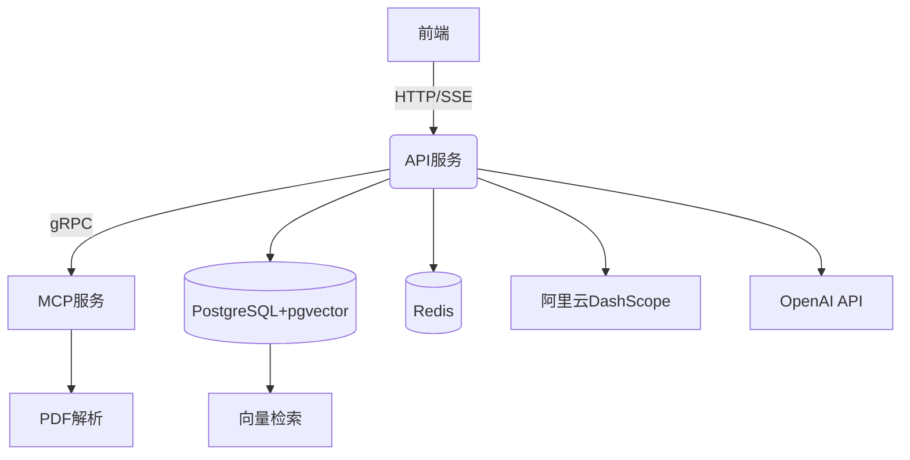

# Gozero+AI面试助手智能体（后端）

## AI面试助手智能体 - 在线体验
- [在线体验](http://aigo.dayu.club/)
## 代码仓库
- [前端代码仓库](https://codeup.aliyun.com/60fadd729187b7df39056384/training_camp/frontend-ai-interview-agent-go)
- [后端代码仓库](https://codeup.aliyun.com/60fadd729187b7df39056384/training_camp/ai-gozero-agent)

## 技术架构

### 核心组件


### 技术栈
- **后端框架**: GoZero
- **AI集成**: 
  - 阿里云DashScope（千问大模型）
  - OpenAI API（Embedding生成）
- **存储**: PostgreSQL + pgvector扩展
- **实时通信**: SSE
- **部署**: Docker + docker-compose

### 第三方API集成
#### 1. 阿里云DashScope
- 用途：千问大模型对话接口
- 配置参数：
  ```yaml
  BaseURL: "https://dashscope.aliyuncs.com/compatible-mode/v1"
  Model: "qwen-plus"
  ```
- 官方文档：
  - [DashScope API文档](https://help.aliyun.com/zh/dashscope/developer-reference)
  - [千问大模型使用指南](https://help.aliyun.com/zh/dashscope/developer-reference/tongyi-qianwen-7b)

#### 2. OpenAI API
- 用途：文本向量化(Embedding)生成
- 依赖库：`github.com/sashabaranov/go-openai`
- 官方文档：
  - [OpenAI API文档](https://platform.openai.com/docs/api-reference)
  - [Embedding生成指南](https://platform.openai.com/docs/guides/embeddings)

## 快速启动
=======

### 后端
1. 下载Docker
2. 执行命令

```
# 启动项目
docker-compose up -d
# 停止项目
docker-compose down -v
```
> **无需配置任何环境，Docker一键部署，包括建表**
### 前端
```
# 安装依赖
npm run install
# 运行
npm run dev
# 打包
npm run build
```


## 常见问题

### 如何上传简历？
通过`/upload`接口上传PDF格式简历，系统将自动解析并生成面试问题。

### 如何扩展知识库？
调用`/knowledge`接口上传专业文档，系统将自动向量化存储。

## 更多项目
>除了这个项目，我们还有其他 [更多优质项目](http://wangzhongyang.com/project/go/)。\
如果你需要[「辅导到就业为止的就业陪跑」](https://mp.weixin.qq.com/s/xi_uYjMzPjjCcMZ3UodE3g)，也欢迎了解我们的  [就业陪跑训练营](https://mp.weixin.qq.com/s/PawAjcqvSH8riPmAdVgiUw)
=======